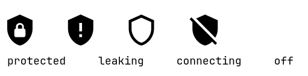
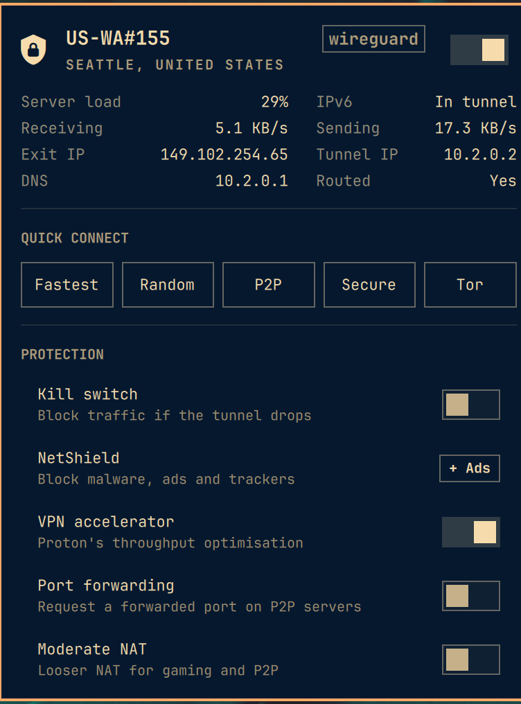
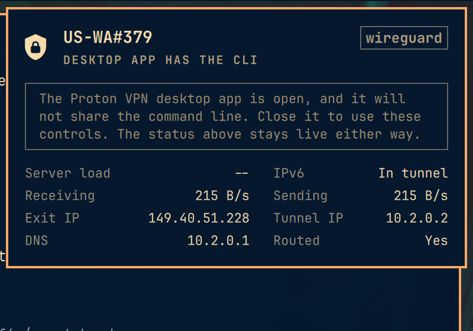

# Proton VPN widget for Omarchy

A native Omarchy bar widget for Proton VPN, built on the same bones as the
first-party Network and Tailscale panels.





## The idea

Most VPN indicators answer one question: is an interface up? That is not the
same question as "am I protected". A tunnel can be up while the default route
still goes out of your Wi-Fi, or while DNS resolves against your ISP. Both look
identical to an on/off dot, and both are worse than no tunnel at all, because
you believe something untrue about your own machine.

So this widget checks three things, not one:

| State | Icon | Meaning |
|---|---|---|
| Protected | filled shield with a lock | Tunnel up, default route through it, DNS answered by it |
| Not protected | filled shield with `!`, in the urgent colour | Tunnel up, but traffic or DNS is bypassing it |
| Connecting | hollow shield | Interface exists, not activated yet |
| Disconnected | shield struck through | No tunnel |

The "not protected" state also raises a banner in the panel naming which of the
two checks failed.

## The Proton VPN desktop app takes the CLI hostage

The `protonvpn` CLI refuses to run at all while the GTK desktop app is open:

```
Error: Proton VPN desktop app is currently running
The CLI and GUI cannot run simultaneously.
```

That takes out server load, settings, the country list and every action at once.
The widget detects it and says so, hides the controls that cannot work, and
keeps the live status, because the fast tier never touches the CLI:



It recovers by itself once the app is closed.

## Interaction

**Bar icon:** left click opens the panel, right click connects or disconnects,
middle click refreshes.

**In the panel:** `j`/`k` or arrows move the cursor, `h`/`l` move across the
quick-connect pills, `enter`/`space` activates, `/` focuses the country filter,
`t` toggles the connection, `d` disconnects, `r` refreshes, `esc` closes.

Mouse and keyboard share a single cursor, so exactly one thing is ever
highlighted. Hovering moves the cursor rather than painting a second highlight.

## What the panel shows

- **Hero**. Server name, city and country, protocol pill, and an on/off switch
  that throws optimistically so it answers the click immediately.
- **Details**. Server load (coloured past 75% and 90%), whether IPv6 is carried
  inside the tunnel, live throughput, exit IP, tunnel IP, DNS, and whether the
  default route actually goes through the tunnel. IPs are click-to-copy.
- **Quick connect**. Fastest, random, P2P, Secure Core, Tor.
- **Protection**. Kill switch, NetShield, VPN accelerator, port forwarding,
  moderate NAT, IPv6. Booleans get a switch; NetShield gets a value pill because
  it has three states and a switch would have to lie about one of them. The whole
  row is the click target either way, so one Enter cycles it.
- **Countries**. Filterable, with the country you are in pinned to the top.
  Clicking one connects to the fastest server there.

Deliberately not surfaced: `custom-dns` (needs addresses typed in, belongs in the
CLI) and `anonymous-crash-reports` (not a networking control). A panel that
mirrors every flag a CLI has is a worse panel than one that picks.

## How it stays fast

Two tiers, because the two sources of truth cost about 18x different amounts.

**Fast: `bin/protonvpn-probe`, ~85ms.** NetworkManager, `/sys`, and Proton's
own session cache. Tunnel state, server name, addressing, DNS, routing and byte
counters. This runs on a timer whether or not the panel is open, which is what
keeps the bar icon honest. It never shells out to `protonvpn`.

**Slow: the `protonvpn` CLI, ~1.5s and occasionally far worse when it decides
to refresh its 24MB server list.** Server load, city, settings, country list.
Only runs while the panel is open, or right after an action. The bar icon never
waits on it.

Proton's session file is only trusted when its `connection_id` matches the
connection NetworkManager currently has up. The file survives a disconnect and
would otherwise describe a session that ended hours ago.

Every poll has a watchdog. A poll is skipped while its own process is still
running, so one that never exits would otherwise stop the panel refreshing at
all, permanently.

## Requirements

- `proton-vpn-cli` on `PATH`, signed in. The panel offers an install button when
  the CLI is missing and a sign-in button when it is not signed in, each opening
  a real terminal, because credential prompts do not belong behind a bar popup.
- `wl-copy` for the click-to-copy values.

No root and no polkit rule: `protonvpn connect` and `disconnect` run as your own
user against the Proton daemon, which owns the privileged part itself.

## Install

```bash
git clone https://github.com/jampick/omarchy-protonvpn \
  ~/.config/omarchy/plugins/jampick.protonvpn

omarchy-shell shell rescanPlugins
omarchy plugin enable jampick.protonvpn
omarchy bar move jampick.protonvpn --before omarchy.network
```

The directory name must match the `id` in `manifest.json`.

If the widget does not appear after a hot reload, restart the shell with
`omarchy restart shell`. The plugin hot-reload path can wedge after repeated
edits, leaving a stale instance answering IPC while the bar slot renders nothing.

## Uninstall

```bash
omarchy plugin disable jampick.protonvpn
rm -rf ~/.config/omarchy/plugins/jampick.protonvpn
```

Disabling removes it from the bar layout in `~/.config/omarchy/shell.json`. The
widget owns no other state: it writes nothing outside its own directory, adds no
systemd units, no polkit rules and no sudoers entries, and it never edits your
Proton VPN configuration except through `protonvpn config set` when you click a
toggle. Nothing to clean up beyond those two lines.

## Settings

Both are exposed through the widget's manifest schema:

| Key | Default | What it does |
|---|---|---|
| `refreshIntervalSec` | 5 | How often the bar icon re-checks the tunnel |
| `detailIntervalSec` | 60 | How often an open panel re-reads load and settings from the CLI |

## Tests

`Model.js` is pure, side-effect-free JavaScript with a `module.exports` guard, so
all the parsing and formatting runs under Node without a compositor:

```bash
cd test && node model.test.js
```

The fixtures in `test/fixtures/` are real captured output from `protonvpn
status`, `config list`, `countries list`, `cities list US`, and the probe, with the
local NetworkManager connection uuid zeroed.

## Layout

```
manifest.json           plugin + bar-widget declaration and settings schema
Panel.qml               bar button, panel UI, cursor model, row components
Service.qml             process orchestration, two-tier polling, watchdogs
Model.js                pure parsing/formatting (Node-testable)
bin/protonvpn-probe     the fast state probe
LICENSE                 MIT, matching Omarchy
test/                   Node tests and real CLI fixtures
```

## Notes for anyone adapting this

- The root item must forward `implicitWidth`/`implicitHeight` from the bar
  button. The bar sizes each slot from its widget's implicit size, and the base
  `Panel` is a bare `Item` with no size of its own, so without this the slot
  collapses to zero width and the widget silently never appears, with no error, no
  warning, and nothing in the log.
- Do not name a property `state`. `QQuickItem` already has one.
- The plugin id is `jampick.protonvpn` because `omarchy.*` is the first-party
  namespace. Renaming it for upstream is a one-line change in `manifest.json`
  plus the two `moduleName`/`ipcTarget` lines.

## IPC

```bash
omarchy-shell jampick.protonvpn status      # "Protected US-WA#379"
omarchy-shell jampick.protonvpn toggle      # open/close the panel
omarchy-shell jampick.protonvpn connect     # fastest server
omarchy-shell jampick.protonvpn disconnect
omarchy-shell jampick.protonvpn toggleVpn   # connect or disconnect
omarchy-shell jampick.protonvpn refresh
```

## Status

Working and in daily use on Omarchy 4.0.0-1. Not submitted upstream: Omarchy
supports third-party plugins as drop-ins, so this does not need to enter the
Omarchy tree to be installable, and upstream appetite for more VPN integrations
is unproven (see basecamp/omarchy#4997 and #7417, both unpicked-up at both small
and large size).
